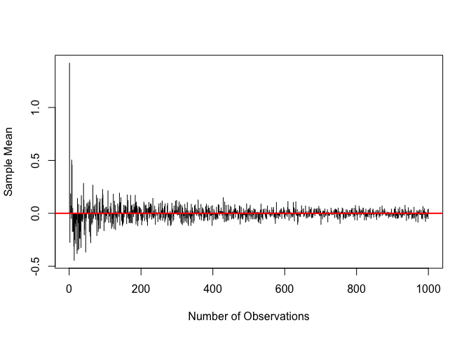

PLS 801 Lab 6: Functional Programming & A Calculus Application
================
Constanza F. Schibber
10/12/2018

# Agenda for Today:

1.  Functions

- An Application: Derivatives

2.  If Statements
3.  Loops

# Functions

We can create our own functions using the `function` command. For
example, say we are interested in the equation $y = 1 + 2x$ and we would
like to calculate $y$ for a number of values of $x$. We can do this by
defining a `function` in where `x` is the input of the function and `y`
is the (returned) output of the function:

``` r
# Define the function, y = 1 + 2x and print the value of y in the output.
first.fun <- function(x) { # open a curly bracket, continue in the next line(s)
  y <- 1 + 2*x
  return(y) # return the output of the function
}# close a curly bracket
```

Once we write the `function`, we can apply it to values of `x`. For
instance, if we want to calculate `y` for `x` equal to 2, we can do:

``` r
# What is the value of y when x=2?
first.fun(2)
```

    ## [1] 5

We could include text in the `return` of our function by using the
command `cat` (Concatenate and Print), which will provide us with extra
information in the output:

``` r
first.fun.full <- function(x) {
  y <- 1 + 2*x
  return(cat('for x equal to', x, 'the value of y is', y, '\n')) #notice the , around the variable x and before y, and ' around the text; \n creates a different line in case we have multiple values of x
}

first.fun.full(2)
```

    ## for x equal to 2 the value of y is 5

Now, if we want to apply the `function` to a number of values of `x` at
the same time, we have to use `sapply`. We start by creating a vector of
values for `x`, then use `sapply` to apply the function to each value in
the vector. The output will be a vector or list of values corresponding
to each `x`.

``` r
# vector for x
x<-seq(0,10)
x
```

    ##  [1]  0  1  2  3  4  5  6  7  8  9 10

``` r
# apply the first function to a vector x
y.fun<- sapply(x, first.fun)
y.fun
```

    ##  [1]  1  3  5  7  9 11 13 15 17 19 21

``` r
is.vector(y.fun)
```

    ## [1] TRUE

``` r
y.fun[1] #value for the first x
```

    ## [1] 1

``` r
# apply the second function
y.full<- sapply(x, FUN=first.fun.full)
```

    ## for x equal to 0 the value of y is 1 
    ## for x equal to 1 the value of y is 3 
    ## for x equal to 2 the value of y is 5 
    ## for x equal to 3 the value of y is 7 
    ## for x equal to 4 the value of y is 9 
    ## for x equal to 5 the value of y is 11 
    ## for x equal to 6 the value of y is 13 
    ## for x equal to 7 the value of y is 15 
    ## for x equal to 8 the value of y is 17 
    ## for x equal to 9 the value of y is 19 
    ## for x equal to 10 the value of y is 21

``` r
is.vector(y.full)
```

    ## [1] TRUE

`y.full` is still a vector but because of the text, it is not useful in
terms of doing other calculations. But, depending on what you are doing,
it is useful to have text or even include warnings in your output.

We can plot this `function`!

``` r
# Plot the first function
plot(y=first.fun(x), x=x,    
     type="l",
     xlab="x", 
     ylab="y", 
     ylim=c(0,25),
     lwd=3,
     col='purple',
     lty=5
     )
```

<!-- -->

We can create a function for a more complicated equation. Let’s consider
a case where $y$ is a function of two variables, $x$ and $z$. That is,
$y = (2x)^3 + \log_{10}{(x+z)}$. Now, notice that we will start our
function as `function(x,z)` because the input will have values for `x`
and for `z`; our return will still be `y`.

``` r
# Function
second.fun <- function(x,z) {
  y<- (2*x)^3 + log10(x+z)
  return(y)
}

# What is the value of y when x=2 and z=8?
second.fun(x=2, z=8)
```

    ## [1] 65

``` r
# How about if we have multiple values of x and z? We cannot use sapply because now our input is not a vector, but 2 vectors or a matrix.

xz<-matrix(c(10:14, 7:11), ncol=2 )  #create a (5x2) matrix 
colnames(xz)<- c("x", "z")           #where the 1st column is x and the 2nd is z
xz
```

    ##       x  z
    ## [1,] 10  7
    ## [2,] 11  8
    ## [3,] 12  9
    ## [4,] 13 10
    ## [5,] 14 11

``` r
mapply(FUN=second.fun, xz[,"x"], xz[, "z"])  
```

    ## [1]  8001.23 10649.28 13825.32 17577.36 21953.40

``` r
# you can check the answer for the first 1,
(2*xz[1,1])^3 + log10(xz[1,1]+xz[1,2]) 
```

    ##       x 
    ## 8001.23

``` r
#checked!
```

**Class Question 1**:

1.  Define the function, $y=(x+1)^2+\sqrt{x}$.
2.  Compute the value of $y$ when $x=4$ using the function.
3.  Apply the function to a sequence of values from -10 to 10. What went
    wrong?
4.  Plot the function for $x$ ranging from 1 to 10.

``` r
#Students write answers here
```

    ## [1] 25.5

    ##  [1]        NaN        NaN        NaN        NaN        NaN        NaN
    ##  [7]        NaN        NaN        NaN        NaN        Inf   5.000000
    ## [13]   9.707107  16.577350  25.500000  36.447214  49.408248  64.377964
    ## [19]  81.353553 100.333333 121.316228

<!-- -->

## An Application:Derivatives

It turns out that `D` is an function to compute derivatives of *simple*
expressions. You can get information by running `help(D)` in the
console.

We can create a function to compute derivatives of simple functions
$f(x)$ and then, we can create figures. Note that we use `expression`
and `eval` in this example. `expression` here creates an object of mode
“expression” (or a vector of type “expression”) containing its
unevaluated arguments, which is a list of calls, symbols, constants etc.
`eval` here evaluates an (unevaluated) “expression” in a specified
environment.

``` r
# Example from Gill 2006, p. 245 (6.4.1 Evaluating Zero-Derivative Points)

## working it with R's expressional forms

# Write the function as an expression
f.245<-expression((1/4)*x^4 - 2*x^3 + (11/2)*x^2 - 6*x + 11/4)
f.245
```

    ## expression((1/4) * x^4 - 2 * x^3 + (11/2) * x^2 - 6 * x + 11/4)

``` r
# Compute first derivative
d.f.245<-D(f.245,"x") 
d.f.245
```

    ## (1/4) * (4 * x^3) - 2 * (3 * x^2) + (11/2) * (2 * x) - 6

``` r
# Compute second derivative
d2.f.245<-D(d.f.245,"x")
d2.f.245
```

    ## (1/4) * (4 * (3 * x^2)) - 2 * (3 * (2 * x)) + (11/2) * 2

``` r
#create functional versions that will evaluate the expressions
fun.f.245<-function(x){eval(f.245)}
fun.d.f.245<-function(x){eval(d.f.245)}
fun.d2.f.245<-function(x){eval(d2.f.245)}

# The critical values are x=1; x=2; x=3. We evaluate at those values. 
# Observe that f'(x) is 0 at the critical values because that is how we calculate them by hand. 
# We can evaluate f''(x) at the critical values to see they are maxima (f''(x)<0), minima (f''(x) > 0), or inflection points (f''(x)=0)
#values at x=1
fun.f.245(1) 
```

    ## [1] 0.5

``` r
fun.d.f.245(1)
```

    ## [1] 0

``` r
fun.d2.f.245(1) # minima
```

    ## [1] 2

``` r
#values at x=2
fun.f.245(2)
```

    ## [1] 0.75

``` r
fun.d.f.245(2)
```

    ## [1] 0

``` r
fun.d2.f.245(2) # maxima
```

    ## [1] -1

``` r
#values at x=3
fun.f.245(3)
```

    ## [1] 0.5

``` r
fun.d.f.245(3)
```

    ## [1] 0

``` r
fun.d2.f.245(3) # minima
```

    ## [1] 2

You can create a figure using the following code. Please, run one line
at a time to understand what is going on. The figure is built by
different components.

``` r
# create a vector with x values
ruler<-seq(-4,7,by=0.01) 

# we create an empty plot (no data points), indicated by type='n'
plot(x=c(-1,5),y=c(-10,10),type='n',xlab="x",ylab="y") 
# horizontal line at 0
abline(h=0,col='gray60')
# vertical line at 0
abline(v=0,col='gray60')
# plot the function f(x)
lines(x=ruler,y=fun.f.245(ruler),lwd=2)
text(x=0,y=5,"f(x)")
# plot the first derivative
lines(x=ruler,y=fun.d.f.245(ruler),lwd=2,lty=2,col='blue')
text(x=0,y=-4,expression(frac(df,dx)), col="blue")
# plot the second derivative
lines(x=ruler,y=fun.d2.f.245(ruler),lwd=2,lty=3,col='red')
text(x=1,y=5,expression(frac(d^2*f,dx^2)), col="red")
# points for x=1
points(x=1,y=fun.f.245(1), pch=16)
points(x=1,y=fun.d.f.245(1),col='blue',pch=16)
points(x=1,y=fun.d2.f.245(1),col='red',pch=16)
# points for x=2
points(x=2,y=fun.f.245(2), pch=16)
points(x=2,y=fun.d.f.245(2),col='blue',pch=16)
points(x=2,y=fun.d2.f.245(2),col='red',pch=16)
# points for x=3
points(x=3,y=fun.f.245(3), pch=16)
points(x=3,y=fun.d.f.245(3),col='blue',pch=16)
points(x=3,y=fun.d2.f.245(3),col='red',pch=16)
```

<!-- -->

You could also enter the derivates computed by hand into the functions,
rather than calculating them using `D`. You cannot calcualte every
derivative using `D`; only the easier ones.

# If Statements

We can execute commands conditional on a Boolean statement using the
`if` command.  
Boolean Expressions are logical statements that are either true or
false. We may use relational/logical operators in .

| R relational operators | Meaning                  |
|------------------------|--------------------------|
| `>`                    | less than                |
| `<`                    | greater than             |
| `==`                   | eqaul to                 |
| `>=`                   | greater than or equal to |
| `<=`                   | less than or equal to    |
| `!=`                   | not equal to             |

| R logical operators | Meaning                  |
|---------------------|--------------------------|
| `!`                 | logical NOT              |
| `|`                 | element-wise logical OR  |
| `||`                | logical OR               |
| `&`                 | element-wise logical AND |
| `&&`                | logical AND              |

See below for some simple examples.

``` r
a <- 3
a
```

    ## [1] 3

``` r
# simple examples
a > 2    # Is a greater than 2?
```

    ## [1] TRUE

``` r
a < 2    # Is a less than 2?
```

    ## [1] FALSE

``` r
a == 2   # Is a eqaul to 2? Note this is different than a=2
```

    ## [1] FALSE

``` r
a != 2   # Is a not equal to 2? 
```

    ## [1] TRUE

``` r
a > 0 & a <2  # Is a greater than 0 AND less than 2?
```

    ## [1] FALSE

``` r
a > 0 | a <2  # Is a greater than 0 OR less than 2?
```

    ## [1] TRUE

## `if`

Using `if` commands, we can request to execute the commands only if a
certain condition is met. We specify the condition to be met in the
parentheses after`if` (using some Boolean statements), then write the
commands to execute within `{  }`.

For example, we have a variable coded as 99 and may want to change it to
“NA”. We can do this using `if`.

``` r
b <- 99
b
```

    ## [1] 99

``` r
if(b == 99){   #if the condition that b is equal to 99 is met
  b <- NA       #then b gets NA
  }
b
```

    ## [1] NA

## `if` `else`

In many situations, we may want to execute some commands if a condition
is met (that is, if logical statements given are `TRUE`), and execture
different commands if a condition is not met (that is, if logical
statements given are `FALSE`).

For example, the function we created above in Class Question 1
(`q1.fun`) has the domain $x\ge 0$. Thus, we can rewrite this funciton
as following using `if` and `else`:

``` r
q1.fun   # recall the function 
```

    ## function(x){
    ##   y <- (x+1)^2 + x^(-1/2)
    ##   return(y)
    ## }
    ## <bytecode: 0x7f986facf7f0>

``` r
q1.fun.if <- function(x){
  if (x >= 0) {                 #if the condition specified in ( ) is met,
    y <- (x+1)^2 + x^(-1/2)     #exectue this function 
  }
  else {                        #if the condition is not met,
    y<- "x must be a non-negative value"}        #execute this function 
  return(y)
}
# What is the value of y when x=-10?
q1.fun.if(x=-10)
```

    ## [1] "x must be a non-negative value"

``` r
# What is the value of y when x=10?
q1.fun.if(x=10)
```

    ## [1] 121.3162

## `ifelse`

We can also use `ifelse` to override ’s natural inclinations. See the
following example.

Draw ten random numbers from a normal distribution where the mean is 2
and the standard deviation is 4. “set.seed” function is to make the
following random draw replicable.

``` r
set.seed(54321008)
y <- rnorm(10, mean=2, sd=4)
y
```

    ##  [1] -0.6218419 -0.4143119  1.0271678  2.0353725  2.9061868  0.6974074
    ##  [7]  1.6044344 -3.5311969  2.3495817  8.1371745

If we take logarithms of `y`, it shows “NaN” (meaning Not a Number) for
the log of negative numbers. However, if we want the log of negative
numbers to be represented by “NA,” we can override as following:

``` r
## log
ylog <- log(y)
```

    ## Warning in log(y): NaNs produced

``` r
ylog
```

    ##  [1]         NaN         NaN  0.02680528  0.71067886  1.06684184 -0.36038555
    ##  [7]  0.47277128         NaN  0.85423730  2.09644301

``` r
## override as following:
ylog <- ifelse(y<0, NA, log(y))
```

    ## Warning in log(y): NaNs produced

``` r
ylog
```

    ##  [1]          NA          NA  0.02680528  0.71067886  1.06684184 -0.36038555
    ##  [7]  0.47277128          NA  0.85423730  2.09644301

**Class Question 2**: `ifelse` can be used in creating a new `function`.
Define the following `funtion`, using `ifelse`.

$f(x) = \begin{cases} -1, \text{if}\ x\leq 0 \\ 1, \text{if}\ x>0 \end{cases}$

What are the values when `x` takes values -5, 0, or 10? Plot the
`function` for $x$ ranging from -5 to 10.

``` r
#Students write answers here
```

    ## [1] -1 -1  1

<!-- -->

# Loops

Loops can be used to repeat calculations that are either identical or
vary only by a few parameters.

## `for`

Let’s consider the following simple example where we want to calculate
the sqaured values for $1,2,3,4, \text{and}\ 5$. So in mathematical
notation, for $x=(1, 2, 3, 4, 5)$ we want to calculate $x_i^2$ where
$i=1, 2, 3, 4, 5$.

To do this calculation we can create a `for` loop in which, for each
value of $x_i$, we do a calculation.

``` r
# create values for x
x4<-seq(1:5)

# Loop 
for(i in 1:5) { #index goes from 1 to 5; open a curly bracket
  output<- x4[i]^2
  print(output) #do calculation and print it (otherwise it won't show you the result)
} # close a curly braket
```

    ## [1] 1
    ## [1] 4
    ## [1] 9
    ## [1] 16
    ## [1] 25

Because we can calculate the `length` of the vector `x4` we can use a
function to calculate the maximum value of the index `i` like this,

``` r
# Loop 
for(i in 1:length(x4)) { #index goes from 1 to the maximum value of the index
  output<- x4[i]^2
  print(output) 
} 
```

    ## [1] 1
    ## [1] 4
    ## [1] 9
    ## [1] 16
    ## [1] 25

Because of the values given in the example, the calculation can be
simplified as $i^2$ where $i=1, \cdots, 5$. We can rewrite the loop as,

``` r
# Loop 
for(i in 1:5) { 
  print(i^2) 
}
```

    ## [1] 1
    ## [1] 4
    ## [1] 9
    ## [1] 16
    ## [1] 25

Or better still, we can avoid using a loop altogether,

``` r
x4^2
```

    ## [1]  1  4  9 16 25

Moving to another example, we can use a `for` loop to write a `function`
to calculate $x!$ (factorial $x$) which is  
$x! = x \times (x-1) \times (x-2) \times (x-3) \dots \times 2 \times 1$

Let’s think about the equation for a minute: What is the factorial of 0?
What is the factorial of 1? What is the factorial of 3?

Now, let’s write a function!

``` r
fact1 <- function(x){ #we cannot name the function factorial because there is already a function in R with that name!
    if (x < 2){
      return(1)
    }
  else{
    f <- 1                  # initialize 
    for (i in 2:x) {
      f <- f * i            # accumulate product
      }
    f                       # return result
  } 
}

# Apply fact1 function to the values 0,1,2,3,4, and 5.
sapply(0:5, fact1)
```

    ## [1]   1   1   2   6  24 120

In this example, $x$ must be a non-negative integer. Thus, we may want
to add an error message in case the input value is negative.

``` r
fact2 <- function(x) {
    if ((!is.numeric(x)) || (x != floor(x))       ##Checking if x is a numeric value, a whole number
        || (x < 0) || (length(x) > 1)){            ##   a negative value, or a single number
        stop("x must be a non-negative integer")  ##If not pass, stop and print error message
      }else{}
    if (x < 2){
      return(1)
      }
       else{
         f <- 1                  # initialize
         for (i in 2:x) {
           f <- f * i            # accumulate product
           }
         }
    print(f)  
}

# Applying the function
fact2(5)
```

    ## [1] 120

``` r
fact2(-5)
```

    ## Error in fact2(-5): x must be a non-negative integer

Luckily, there is a `factorial` function that you can use.

``` r
# we get the same result as with fact2
factorial(5)
```

    ## [1] 120

Let’s try a big number,

``` r
factorial(100000)
```

    ## [1] Inf

where the result says it is `Inf` which is R talk for `infinity`. But we
know we can compute that! What happened? You will learn about this in
the reading for Lab 7 (so do the reading!).

## Simulation using loops

This example illustrates the law of large numbers, by simulating random
observations from the standard normal distribution. In this example, we
draw random samples with increasing sample sizes from 1 to 1000. Then we
calculate the mean of each sample and plot our sample means against the
sample size.

``` r
set.seed(271828183)

# Create a blank vector of length 1000 called store
#    where our output from the loop will be stored
store <- matrix(NA, 1000, 1) 
                             
for (i in 1:1000){
  # "a" gets i obs randomly drawn from a stanadard normal distribution 
  a <- rnorm(i)
  # Calculate the mean of "a" and record in the "i"th cell of "store"
  store[i] <- mean(a)        
  }

plot(store, type="h",        # type="h" for 'histogram' like (or 'high-density') vertical lines
     ylab="Sample Mean", 
     xlab="Number of Observations"
     )
abline(h=0, col='red', lwd=2) #Add a line at the population mean (which is zero)
```

<!-- -->
