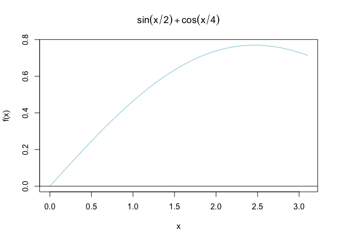

Lab 6 - Newton Raphson Method
================
Constanza F. Schibber
10/17/2017

``` r
# Newton Raphson Method
newton <- function(f, tol=1E-12, x0=1, N=20) {
        h <- 0.001
        i <- 1
        x1 <- x0
        p <- matrix(NA, ncol=N)
        for(i in 1:N) {
                df.dx <- (f(x0+h)-f(x0))/h
                x1 <- (x0 - (f(x0)/df.dx))
                p[i] <- x1
                i <- i + 1
                if (abs(x1-x0) < tol) break
                x0 <- x1
        }
        return(p[1:(i-1)])
}
```

Let’s say we have the following function,

$$y = \sin\left(\frac{x}{2}\right)\cos\left(\frac{x}{4}\right)$$

which looks like this,

``` r
f <- function(x){sin(x/2)* cos(x/4)}
x<-seq(from=-100, to=100, by=.1)
plot(x,f(x), type='l', lwd=3, main=expression(sin(x/2) + cos(x/4)), col='blue') 
abline(h=0)
```

%20and%20plot-1.png)<!-- -->

Because of the nature of the function, we focus on the interval
$[-3\pi, -2pi]$ and apply the Newton-Raphson algorithm on that interval
to investigate potential critical values of $f(x)$.

Let’s make a figure,

``` r
x<-seq(from=0, to=pi, by=.1)
  plot(x,f(x), type='l', lwd=1.5, main=expression(sin(x/2) + cos(x/4)), col="lightblue") 
abline(h=0)
```

<!-- -->

and apply the algorithm.

``` r
p<-newton(f, tol=1E-12, x0=3, N=20)
p
```

    ##  [1] 8.060571 6.986721 6.625806 6.453685 6.368554 6.326102 6.304889 6.294281
    ##  [9] 6.288972 6.286309 6.284963 6.284269 6.283898 6.283689 6.283562 6.283481
    ## [17] 6.283426 6.283387 6.283358 6.283336

which gives us the critical value at which $f(x)$ crosses the x-axis
within the interval $[-3\pi, -2pi]$.
