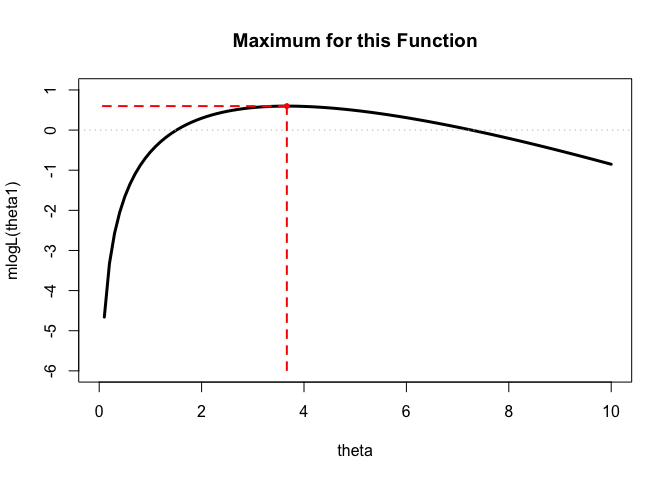

PLS 801 Lab 7: Optimization
================
Constanza F. Schibber
October 19, 2017

- [Package `gsl`](#package-gsl)
- [Computer Representation of Real
  Numbers](#computer-representation-of-real-numbers)
- [Reimann Zeta Function](#reimann-zeta-function)
- [Optimization](#optimization)
  - [`mle`](#mle)
  - [`optimize` in $\mathcal{R}^1$](#optimize-in-mathcalr1)
  - [`optim` in $\mathcal{R}^2$](#optim-in-mathcalr2)
  - [Starter example](#starter-example)
- [Gamma Example (11.2, 11.4)](#gamma-example-112-114)

# Package `gsl`

You will need the package `gsl` (an R wrapper for the special functions
and quasi random number generators of the Gnu Scientific Library).
Install it and then comment out the code so that you do not keep
installing it every time you compile this file.

``` r
#install.packages("gsl")
library(gsl)
#install.packages("stats4")
library(stats4) #mle function
```

# Computer Representation of Real Numbers

It is important that you understand what a *floating point* and a *fixed
point* is. Please, go over the reading (you might have to read the first
2 pages a number of times).

``` r
(0.3 - 0.1)
```

    ## [1] 0.2

``` r
(0.3 - 0.1) == 0.2 
```

    ## [1] FALSE

``` r
#Why "FALSE"? Let's check the following.
0.2 - (0.3 - 0.1)
```

    ## [1] 2.775558e-17

``` r
# Use all.equal to check for near equality of two R objects
# Use isTRUE to obtain a logcal value (in a logical expression)
isTRUE(all.equal(0.2, 0.3 - 0.1))
```

    ## [1] TRUE

``` r
all.equal(0.2, 0.3)   #not always a logical value
```

    ## [1] "Mean relative difference: 0.5"

``` r
isTRUE(all.equal(0.2, 0.3))   #always a logical value
```

    ## [1] FALSE

``` r
# Use identical function to test whether two objects are identical
identical(0.2, 0.3-0.1)
```

    ## [1] FALSE

``` r
x <- 1:4
y <- 2
y == 2
```

    ## [1] TRUE

``` r
x == y #not necessarily a single logical value
```

    ## [1] FALSE  TRUE FALSE FALSE

``` r
identical(x, y)  #always a single logical value
```

    ## [1] FALSE

``` r
identical(y, 2)
```

    ## [1] TRUE

`.Machine` is a variable holding information on the numerical
characteristics of the machine R is running on, such as the largest
double or integer and the machine’s precision. For example, the largest
interger in is $2147483647$ which is $2^{31}$ (`.Machine$integer.max`)

``` r
help(.Machine)

#see the complete list of .Machine
.Machine
```

    ## $double.eps
    ## [1] 2.220446e-16
    ## 
    ## $double.neg.eps
    ## [1] 1.110223e-16
    ## 
    ## $double.xmin
    ## [1] 2.225074e-308
    ## 
    ## $double.xmax
    ## [1] 1.797693e+308
    ## 
    ## $double.base
    ## [1] 2
    ## 
    ## $double.digits
    ## [1] 53
    ## 
    ## $double.rounding
    ## [1] 5
    ## 
    ## $double.guard
    ## [1] 0
    ## 
    ## $double.ulp.digits
    ## [1] -52
    ## 
    ## $double.neg.ulp.digits
    ## [1] -53
    ## 
    ## $double.exponent
    ## [1] 11
    ## 
    ## $double.min.exp
    ## [1] -1022
    ## 
    ## $double.max.exp
    ## [1] 1024
    ## 
    ## $integer.max
    ## [1] 2147483647
    ## 
    ## $sizeof.long
    ## [1] 8
    ## 
    ## $sizeof.longlong
    ## [1] 8
    ## 
    ## $sizeof.longdouble
    ## [1] 16
    ## 
    ## $sizeof.pointer
    ## [1] 8
    ## 
    ## $longdouble.eps
    ## [1] 1.084202e-19
    ## 
    ## $longdouble.neg.eps
    ## [1] 5.421011e-20
    ## 
    ## $longdouble.digits
    ## [1] 64
    ## 
    ## $longdouble.rounding
    ## [1] 5
    ## 
    ## $longdouble.guard
    ## [1] 0
    ## 
    ## $longdouble.ulp.digits
    ## [1] -63
    ## 
    ## $longdouble.neg.ulp.digits
    ## [1] -64
    ## 
    ## $longdouble.exponent
    ## [1] 15
    ## 
    ## $longdouble.min.exp
    ## [1] -16382
    ## 
    ## $longdouble.max.exp
    ## [1] 16384

Keep in mind the limitations of the machine. See the following
example.  
And, sometimes we need to think about how to rewrite the functions to
avoid this type of problem. (Example 11.2 in the reading shows another
example for this type of problem.)

``` r
factorial(170)
```

    ## [1] 7.257416e+306

``` r
factorial(171)
```

    ## [1] Inf

# Reimann Zeta Function

The Reimann Zeta function is given by,

We can rewrite this using the Laurent Series (it is known),

Take the derivative:
$\zeta'(z)= -\frac{1}{(z-1)^2}+ 0 - \gamma_1 + \gamma_2(z-1)+ \dots$

Based on this we can write a function in for the derivative of zeta
function. In this example, only five of the constants are used.

``` r
zeta.deriv <- function(a) {
  z <- a - 1
  #Stieltjes constants gamma_k for k=1:5
  g <- c(
    -.7281584548367672e-1, #gamma_1
    -.9690363192872318e-2, #gamma_2
     .2053834420303346e-2, #gamma_3
     .2325370065467300e-2, #gamma_4
     .7933238173010627e-3) #gamma_5
  i <- c(-1, 1, -1, 1, -1)
  n <- 0:4
  -1/z^2 + sum(i * g * z^n /factorial(n))
}
```

This version of the zeta derivative gives quite good results, especially
over the interval $(1, 2)$. Let’s compare the values returned by
`zeta.deriv(a)` to the values calculated using the central difference
formula, $\zeta'(z) \cong \frac{\zeta(z+h) - f(z-h)}{2h}$

``` r
library(gsl)  #for zeta function
z <- c(1.001, 1.01, 1.5, 2, 3, 5, 10, 1000)
h <- .Machine$double.eps^0.5
dz <- dq <- rep(0, length(z))
for (i in 1:length(z)) {
  v <- z[i] + h
  h <- v - z[i]
  a0 <- z[i] - h
  if (a0 < 1) a0 <- (1 +z[i])/2
  a1 <- z[i] + h 
  dq[i] <- (zeta(a1) - zeta(a0)) / (a1-a0)
  dz[i] <- zeta.deriv(z[i])
    }

h
```

    ## [1] 1.490116e-08

``` r
cbind(z, dz, dq)
```

    ##             z            dz            dq
    ## [1,]    1.001 -9.999999e+05 -9.999999e+05
    ## [2,]    1.010 -9.999927e+03 -9.999927e+03
    ## [3,]    1.500 -3.932240e+00 -3.932240e+00
    ## [4,]    2.000 -9.375469e-01 -9.375482e-01
    ## [5,]    3.000 -1.981009e-01 -1.981262e-01
    ## [6,]    5.000 -2.853446e-02 -2.857378e-02
    ## [7,]   10.000 -4.426583e-02 -6.970316e-04
    ## [8,] 1000.000 -3.253777e+07  0.000000e+00

``` r
cbind(z, dz, dq, dq-dz) #see the difference between dq and dz 
```

    ##             z            dz            dq              
    ## [1,]    1.001 -9.999999e+05 -9.999999e+05 -2.198743e-04
    ## [2,]    1.010 -9.999927e+03 -9.999927e+03  3.118595e-06
    ## [3,]    1.500 -3.932240e+00 -3.932240e+00 -2.513160e-08
    ## [4,]    2.000 -9.375469e-01 -9.375482e-01 -1.306658e-06
    ## [5,]    3.000 -1.981009e-01 -1.981262e-01 -2.530270e-05
    ## [6,]    5.000 -2.853446e-02 -2.857378e-02 -3.932525e-05
    ## [7,]   10.000 -4.426583e-02 -6.970316e-04  4.356880e-02
    ## [8,] 1000.000 -3.253777e+07  0.000000e+00  3.253777e+07

We can write another version of the finite series approximation of the
numerical derivative. In Ex.11.4 only five of the constants are used. We
can add more terms if greater accuracy is needed. The following example
used seven of the constants. In the comparison to the numerical
derivative using the central difference formula, we can see some
improvements.

``` r
## More terms are added for the derivative of zeta function
## Now, it gives us more accurate results for large values of z

zeta.deriv2 <- function(a) {
  z <- a - 1
  #Stieltjes constants gamma_k for k=1:7
  g <- c(
    -.7281584548367672e-1,
    -.9690363192872318e-2,
     .2053834420303346e-2,
     .2325370065467300e-2,
     .7933238173010627e-3,
    -.2387693454301996e-3,
    -.5272895670577510e-3
    )
  i <- c(-1, 1, -1, 1, -1, 1, -1)
  n <- 0:6
  -1/z^2 + sum(i * g * z^n /factorial(n))
}

z <- c(1.001, 1.01, 1.5, 2, 3, 5, 10, 1000)
h <- .Machine$double.eps^0.5

dz2 <- dq2 <- rep(0, length(z))
for (i in 1:length(z)) {
  v <- z[i] + h
  h <- v - z[i]
  a0 <- z[i] - h
  if (a0 < 1) a0 <- (1 +z[i])/2
  a1 <- z[i] + h 
  dq2[i] <- (zeta(a1) - zeta(a0)) / (a1-a0)
  dz2[i] <- zeta.deriv2(z[i])
}

h
```

    ## [1] 1.490116e-08

``` r
cbind(z, dz2, dq2, round(dz2-dq2,3))
```

    ##             z           dz2           dq2             
    ## [1,]    1.001 -9.999999e+05 -9.999999e+05 0.000000e+00
    ## [2,]    1.010 -9.999927e+03 -9.999927e+03 0.000000e+00
    ## [3,]    1.500 -3.932240e+00 -3.932240e+00 0.000000e+00
    ## [4,]    2.000 -9.375482e-01 -9.375482e-01 0.000000e+00
    ## [5,]    3.000 -1.981177e-01 -1.981262e-01 0.000000e+00
    ## [6,]    5.000 -2.757226e-02 -2.857378e-02 1.000000e-03
    ## [7,]   10.000  2.274408e-01 -6.970316e-04 2.280000e-01
    ## [8,] 1000.000  7.259512e+11  0.000000e+00 7.259512e+11

# Optimization

Take the following function,

We take the first derivative to find the value of $\theta$ that
maximizes $\ell(\theta)$, and then, for the purpose of the exercise, we
assume $n=2$,$y_1=0.04304550$, and $y_2=0.50263474$.

To find the value of $\theta$ that maximizes this equation, we can set
$\frac{d}{d \theta}\ell(\theta)=0$ and solve for $\theta$,

The value of $\ell(\theta)$ at this point is,

``` r
2*log(3.66515)-3.66515*(0.04304550+0.50263474)
```

    ## [1] 0.5977386

To know if this is a min/max, you could keep going an evaluate the
second derivative.

## `mle`

Alternatively, we can do all this in R using the function `mle` which
searches for a *minimum* of $\ell(\theta)$. It uses an algorithm so it
will only find either a maximum or a minimum, but it can also never
converge.

We start by writing a `function` for $\ell(\theta)$. Then, we calculate
$\ell(\theta)$ for some values of $\theta$.

``` r
# Our function l(theta)
mlogL <- function(theta) {
    # sample y
    y <- c(0.04304550, 0.50263474)
    # n is the number of values of y give
     n<- length(y)
    # function
     f<- n * log(theta) - theta * sum(y)
     return(f)
}

# Calculate l(theta) for different thetas
mlogL(.1)
```

    ## [1] -4.659738

``` r
mlogL(2)
```

    ## [1] 0.2949339

``` r
mlogL(3)
```

    ## [1] 0.5601839

``` r
mlogL(4)
```

    ## [1] 0.5898678

``` r
mlogL(5)
```

    ## [1] 0.4904746

``` r
mlogL(6)
```

    ## [1] 0.3094375

``` r
# Figure 
theta1<-seq(from=0, to=10, by=.1) #y >0
plot(theta1, mlogL(theta1), type='l', ylim=c(-6, 1), lwd=3, xlab='theta')
abline(h=0, lty=3, col='grey')
```

<!-- -->

We want to apply `mle` to our function `mlogL` and we get the same
result for $\theta$ as we had before. However, computers usually have
problems calculating maximum values and have less difficulties
calculating minimum values; in this case, `mle` calculates de minimum so
it needs, as input, $-\ell(\theta)$. We re-write our function `mlogL` to
`return` the negative of our original function and call it `neglogL`:

``` r
# Our function l(theta)
neglogL <- function(theta) {
    # sample y
    y <- c(0.04304550, 0.50263474)
    # n is the number of values of y give
     n<- length(y)
    # function
     f<- n * log(theta) - theta * sum(y)
     return(-f) # Add negative value
}
```

Now, we apply `mle`:

``` r
# The initial value for the optimizer could be supplied in the call to mle, for example: 
fit1 <- mle(neglogL, start=list(theta=1))
summary(fit1)
```

    ## Maximum likelihood estimation
    ## 
    ## Call:
    ## mle(minuslogl = neglogL, start = list(theta = 1))
    ## 
    ## Coefficients:
    ##       Estimate Std. Error
    ## theta  3.66515   2.591652
    ## 
    ## -2 log L: -1.195477

``` r
## mean of y as starting value
y.mean<-(0.0430455+ 0.50263474)/2
fit2 <- mle(neglogL, start=list(theta=y.mean))
summary(fit2)
```

    ## Maximum likelihood estimation
    ## 
    ## Call:
    ## mle(minuslogl = neglogL, start = list(theta = y.mean))
    ## 
    ## Coefficients:
    ##       Estimate Std. Error
    ## theta  3.66515   2.591652
    ## 
    ## -2 log L: -1.195477

``` r
# calculating the value for the function, but using mlogL (not the negative!)
# Compare to the previous values we had calculated before
mlogL(coef(fit2)) # coef takes the coefficient from fit2
```

    ##     theta 
    ## 0.5977386

``` r
# Figure
theta1<-seq(from=0, to=10, by=.1) #y >0
plot(theta1, mlogL(theta1), 
     type='l', 
     ylim=c(-6, 1), 
     lwd=3, 
     xlab='theta', 
     main="Maximum for this Function")
# line at x=0
abline(h=0, lty=3, col='grey')
# max
points(coef(fit2), mlogL(coef(fit2)), pch=20, col='red')
# One segment
segments(x0=coef(fit2), y0=mlogL(coef(fit2)), x1=coef(fit2), y1=-6, lwd=c(2,2), lty=c(2,2), col=c('red', 'red'))
# Second segment
segments(x0=coef(fit2), y0=mlogL(coef(fit2)), x1=0, y1=mlogL(coef(fit2)), lwd=c(2,2), lty=c(2,2), col=c('red', 'red'))
```

<!-- -->

## `optimize` in $\mathcal{R}^1$

The function `optimize` uses a number of algorithms (you can specify
which one) to calculate the max/min. The default calculates the minimum
(again, computers), but we can specify that we want the maximum with
`maximum=TRUE`. Another advantage, is that it allows to set an interval
\[a,b\] in which it will find the max/min of a function `f` with respect
to a variable. That is useful if a function has multiple max/min, so we
could specify different intervals to search. Remember that these
functions use an algorithm and they will find only one point, since once
it converges it will stop!

``` r
# apply optimize, set interval
fit3<-optimize(mlogL, lower=0, upper=10, maximum = TRUE)
fit3
```

    ## $maximum
    ## [1] 3.66514
    ## 
    ## $objective
    ## [1] 0.5977386

``` r
# theta max
fit3$maximum
```

    ## [1] 3.66514

``` r
# value of the function at max
fit3$objective
```

    ## [1] 0.5977386

**Class Exercise** (1) Try taking out `maximum=TRUE`. What happens? (2)
Take out `maximum=TRUE` and replace the function with the negative
version of the function we had created before.

**Your assignment**: The reading has another example, now you can follow
it on your own. Follow the equation, calculate the maximum, the value of
the function at the maximum, and create a figure. You can check your
results by hand.

``` r
#plot the given function
x <- seq(2, 14.5, .001)
y <- log(x + log(x))/(log(1+x))
plot(x, y, type ="l", xlim=c(1.7,14.5), lwd=3, col='coral1')
```

<!-- -->

``` r
#the figure shows that the maximum occurs beween 4 and 8
#apply optimize on the interval (4, 8) to maximize f(x)
f <- function(x) log(x + log(x))/log(1+x)
optimize(f, lower = 4, upper =8, maximum = TRUE) 
```

    ## $maximum
    ## [1] 5.792299
    ## 
    ## $objective
    ## [1] 1.055122

## `optim` in $\mathcal{R}^2$

The `optim` function searches for the critical value for which our
function has a minimum (default) when we have more than one dimension.

## Starter example

Let’s start with a simpler exam than the one the books shows. Let’s find
where the following function has a minimum: $(x-2)^2-(y-1)^2$.

``` r
# Our function
fnxy<-function(x, y){
f<-(x-2)^2+(y-1)^2
return(f)
}

# values of x, y, z
x<-seq(-5, 5, by=0.1)
y<-seq(-5, 5, by=0.1)
z<-outer(x, y, fnxy)

# figure
persp(x, y, z, 
      phi=25, #angles defining the viewing direction
      theta=10, #angles defining the viewing direction
      col='purple',
      shade=1/100^100,
      ticktype="detailed")
```

<!-- -->

Now, let’s find the value of $(x^*, y^*)$ for which the `function` has a
maximum. The function `optim` works in multiple dimensions but it
requires us to pass a function that has a vector of unknows. So rather
than using the previous function that with parameters `x` and `y`, we
now re-write the function in terms of the vector `x` with elements
`x[1]` and `x[2]`

``` r
# New function in terms of x
fnx<-function(x){
f<-(x[1]-2)^2+(x[2]-1)^2
return(f)
}

# optim
optim(par=c(0,0), #initial values
      fn=fnx, #our function
      method="BFGS", #algorithm to be used
      hessian=TRUE) # we want the hessian
```

    ## $par
    ## [1] 2 1
    ## 
    ## $value
    ## [1] 6.357135e-26
    ## 
    ## $counts
    ## function gradient 
    ##        9        3 
    ## 
    ## $convergence
    ## [1] 0
    ## 
    ## $message
    ## NULL
    ## 
    ## $hessian
    ##      [,1] [,2]
    ## [1,]    2    0
    ## [2,]    0    2

**What do you observe in the results?** - The critical point is
(x,y)=(2,1) - convergence = 0, it means the algorithm converged -
Hessian is positive definite, so the critical point is a minimum

**Potential problems** - algorithm could not convergene (convegence=0) -
Hessian is not positive definite nor negative definite. The algorithm
will have problems and it could give you the wrong answer (it will give
you an answer that is wrong!)

# Gamma Example (11.2, 11.4)

The following function (Example 11.12), for $x \geq 0$,

In example 11.12 of the reading, they take the partial derivatives with
respect to $\lambda$ and with respect to $r$. This results in the
gradient of the function. Setting that equal to zero, one can get the
value of critical values of $\lambda$ and $r$ with subtitution. It turns
out that $\lambda^* = \frac{nr}{\sum_{i=1}^n x_i}$ and
$r=\frac{\sum_{i=1}^n x_i}{n}\lambda$.

Rather than focusing on the use of `uniroot`, we will move to section
11.6 and look at the function `optim`. The function `optim` looks for
maxima/minima in multiple dimensions – in this case we have two
dimensions.

On example 11.13 they continue with the same equation as above, but they
change the order of the terms, which does not really matter for
computation.

The parameters are $\lambda$ and $r$. We write a `function` for using
$\theta={r,\lambda}$ (because of the way `optim` works). (see the
equation (11.8) in the reading)

``` r
LL<-function(theta, x){
  n<-length(x)
  r<-theta[1]
  lambda<-theta[2]
  loglik<-n*r*log(lambda)
      +(r-1)*sum(log(x))
      - lambda* sum(x)
      - n*lgamma(r) #using log(gamma(r)) gives error because calc gets too large
  return(-loglik)
}
```

Let’s create some values of x (more on this in a few weeks) and
calculate `LL` for those values of x by giving the function different
values of $\theta$.:

``` r
# Create the values of x like the book (p.340)
n<-200
r<-5
lambda<-2
x<-rgamma(n, shape=r, rate=lambda)

# For the x we created, let's calculate the value of the function
# for different values of theta={r, lambda}
# Remember we are returning the negative of the function
LL(theta=c(5, 2), x)
```

    ## [1] -693.1472

``` r
LL(theta=c(3, 1), x)
```

    ## [1] 0

Now we want to calculate the values of the variables for which the
`function` takes the maximum value.

``` r
# see all specifications for optim
help(optim)

# apply optim to LL
optim(c(1,1), #initial values
      fn=LL, # function
      x=x, #function needs x
    #  control=list(fnscale=-1, #indicate this is a maximization
     #   reltol=.Machine$double.eps^2, # tolerance
    #             maxit=1000)#, # number of iterations, default is 500
      hessian=TRUE # return hessian
      )
```

    ## $par
    ## [1] 4.996335e+54 2.684172e+55
    ## 
    ## $value
    ## [1] -1.27536e+59
    ## 
    ## $counts
    ## function gradient 
    ##      501       NA 
    ## 
    ## $convergence
    ## [1] 1
    ## 
    ## $message
    ## NULL
    ## 
    ## $hessian
    ##      [,1] [,2]
    ## [1,]    0    0
    ## [2,]    0    0

It turns out the values `optim` found are very close to the ones we
specified when we created `x`. So this is a way to find `r` and `lambda`
if have a bunch of data and we do not know them!

Now, this example, even though we got similar results back, it is a
tricky one. To start with, `convergence` says 1 and this means `optim`
did not converge. It should say that convergence is 0 to indicate it
converged. (I do not know why the book results say it converged, and
gives the value of 0.)

Second, adding iterations only makes it worse (you can try specifying
`maxit`).

Third, looking at the Hessian, it is a matrix of zeroes which is
definetely a bad sign (it is not positive/negative definite because the
determinant is 0). You can also see that the algorithm could not
calculate the gradient, which is another bad sign.

You can try different algorithms, but mostly they do not work well.
