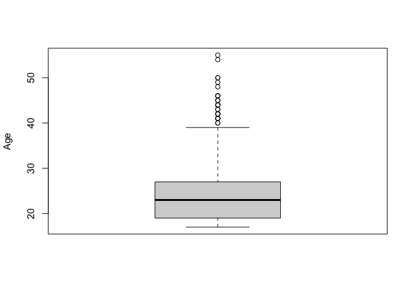
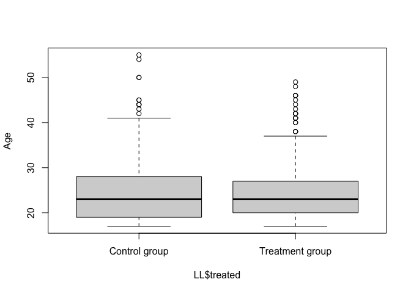
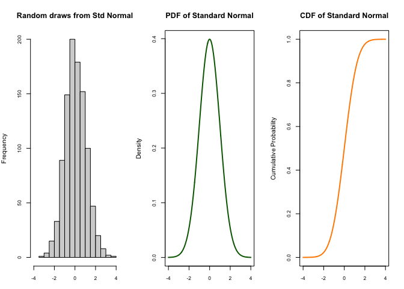

Lab 9: Statistics and Probability Distributions
================
Constanza F. Schibber
November 19, 2020

**Agenda**

1.  Levels of Measurements
2.  Descriptive Statistics  

- Measures of Central Tendency  
- Measures of Dispersion
- Visualization: The Boxplot

3.  Probability Distributions in R: The Normal Distribution

# Levels of Measurement

In empirical research, data can be classified along several dimensions.
We can distinguished between **discrete** (countable) and **continuous**
(uncountable) data. We can also look at the **precision** with which the
underlying quantities are measured.

Levels of Measurement:

- Nominal: Discrete data are nominal if there is no way to put the
  categories represented by the data into a meaningful order. Typically,
  this kind of data represents names (hence \`nominal’) or attributes,
  like Republican or Democrat. A classic example would be eye color
  (blue, green, brown, etc.).

- Ordinal: Discrete data are ordinal if there is a logical order to the
  categories represented by the data, but there is no common scale for
  differences between adjacent categories. Ideology is commonly measured
  as ordinal: Very liberal, Liberal, Somewhat liberal, Somewhat
  conservative, etc.

- Interval: Discrete or continuous data are interval if there is an
  order to the values and there is a common scale, so that differences
  between two values have substantive meanings. Dates are common
  interval data. Year is discrete interval data.

- Ratio: Discrete or continuous data are ratio if the data have the
  characteristics of interval data and zero is a meaningful quantity.
  Quantities measured in dollars, such as per capita GDP, are ratio
  data.

## Summary

| Levels of measurement | Types of Data               |
|-----------------------|-----------------------------|
| Nominal level         | Discrete Data (Categorical) |
| Ordinal level         | Discrete Data (categorical) |
| Interval level        | Discrete or Continous Data  |
| Ratio level           | Discrete or Continous Data  |

## Measurement and Visualization

| Types of Data               | Figure    |
|-----------------------------|-----------|
| Discrete Data (categorical) | Bar Chart |
| Continuous                  | Histogram |

The QSS book has more figures.

## Example: National Supported Work Demonstration

The working example for today and the next lab will be policy-focused
data from LaLonde’s (1986) analysis of the National Supported Work
Demonstration, a 1970s program that helped long-term unemployed
individuals find private sector jobs and covered the labor costs of
their employment for a year.

``` r
#Download (to your working directory) and read the data 
#getwd()
LL<-read.csv('LL.csv', header=TRUE)

#Alternatively, we can load data via the 'cem' library, install 'cem' once on first use
#install.packages('cem')
#library(cem)
#data(LL)

head(LL)
```

    ##   treated age education black married nodegree      re74      re75       re78
    ## 1       1  33        12     0       1        0     0.000     0.000 12418.0703
    ## 2       1  20        12     0       1        0  8644.156  8644.156 11656.5059
    ## 3       0  39        12     1       1        0 19785.320  6608.137   499.2572
    ## 4       1  49         8     0       1        1  9714.597  7285.948 16717.1211
    ## 5       0  26         8     0       1        1 37211.758 36941.266 30247.5000
    ## 6       0  38        10     1       1        1 14759.063 14701.947  4393.5229
    ##   hispanic u74 u75
    ## 1        0   1   1
    ## 2        0   0   0
    ## 3        0   0   0
    ## 4        0   0   0
    ## 5        0   0   0
    ## 6        0   0   0

``` r
#View(LL)
```

Let’s focus on two variables.

*black*: Indicator variable for whether the participant is
African-American.  
*age*: Measured in years.

Let’s try the default figures.

``` r
#"black" is a nominal-level variable (Categorical data)
barplot(table(LL$black)) #Bar chart for a discrete variable
```

<!-- -->

``` r
table(LL$black)
```

    ## 
    ##   0   1 
    ## 144 578

``` r
# "age" is an interval variable because it has a meaningful zero (Continuous data, technically)
hist(LL$age) # Histogram for a continuous variable
```

<!-- -->

``` r
summary(LL$age)
```

    ##    Min. 1st Qu.  Median    Mean 3rd Qu.    Max. 
    ##   17.00   19.00   23.00   24.52   27.00   55.00

**Now, let’s do a better version of both figures.**

We start with the `barplot` and change several defaults.

``` r
# "black" is a nominal-level variable (Discrete data)
# Bar chart for a discrete variable
barplot(table(LL$black), 
        # the default figure had y-axis up to 400 
        ylim=c(0,600), 
        # Add labels so that we don't have 0 and 1 under bars
        names.arg=c("Not African-American", "African-American"),
        # more fun
        col='purple')  
```

<!-- -->

``` r
# Look at a table of the data
table(LL$black)
```

    ## 
    ##   0   1 
    ## 144 578

Now moving to the `histogram`, we change defaults as well.

``` r
# "age" is a interval variable (Continuous data)
# Histogram for a continuous variable
hist(LL$age, 
     # Add label for x-axis
     xlab="Age",
     # add more 'bins'
     breaks=48,
     # change length of x-axis
     xlim=c(15, 60),
     # Let's take out the horrible main title
     main="") 
```

<!-- -->

``` r
# summary of the variable
summary(LL$age)
```

    ##    Min. 1st Qu.  Median    Mean 3rd Qu.    Max. 
    ##   17.00   19.00   23.00   24.52   27.00   55.00

We can also make the histogram with density on the y-axis, rather than
frequency.

``` r
# "age" is a interval variable (Continuous data)
# Histogram for a continuous variable
hist(LL$age, 
     # frequency, we do not want
     freq = FALSE,
     # Add label for x-axis
     xlab="Age",
     # less 'bins'
     breaks=16,
     # change length of x-axis
     xlim=c(15, 60),
     # change length of y-axis
     ylim=c(0, .10),
     # Let's take out the horrible main title
     main="") 
# Add density curve
lines(density(LL$age), col='red', lwd=3)
```

<!-- -->

``` r
# summary of the variable
summary(LL$age)
```

    ##    Min. 1st Qu.  Median    Mean 3rd Qu.    Max. 
    ##   17.00   19.00   23.00   24.52   27.00   55.00

# Descriptive Statistics

| Descriptive Statistics        | R function                   |
|-------------------------------|------------------------------|
| Mean ($\bar{x}$)              | `mean(Variable)`             |
| Median                        | `median(Variable)`           |
| Inter-quartile range          | `IQR(Variable)`              |
| A five-number summary         | `summary(Variable)`          |
| Frequency Table and the model | `which.max(table(Variable))` |
| Variance                      | `var(Variable)`              |
| Standard Deviation            | `sd(Variable)`               |
| Median absolute deviation     | `mad(Variable)`              |
| Quantiles                     | `quantile(Variable)`         |

## Measures of Central Tendency

### Continuous Random Variables

Print descriptive statistics for continuous variables. For example, what
is the mean, median, and IQR of the variable `re74` (participant income
in 1974)?

``` r
# Summary statistics for participant income in 1974
summary(LL$re74)
```

    ##    Min. 1st Qu.  Median    Mean 3rd Qu.    Max. 
    ##     0.0     0.0   823.8  3630.7  5211.8 39570.7

``` r
# Mean of participant income in 1974
mean(LL$re74)
```

    ## [1] 3630.738

``` r
# Density plot of participant income in 1974, with vertical line at the mean
dens.74<-density(LL$re74,from=0)
plot(dens.74, main="Income in 1974", lwd=3)
abline(v=mean(LL$re74),col='red')
```

<!-- -->

``` r
# Median of participant income in 1974
median(LL$re74)
```

    ## [1] 823.8215

``` r
# Increase number of digits
options(digits=9)

#summary statistics for all variables in the dataset
summary(LL)
```

    ##     treated              age            education           black         
    ##  Min.   :0.000000   Min.   :17.0000   Min.   : 3.0000   Min.   :0.000000  
    ##  1st Qu.:0.000000   1st Qu.:19.0000   1st Qu.: 9.0000   1st Qu.:1.000000  
    ##  Median :0.000000   Median :23.0000   Median :10.0000   Median :1.000000  
    ##  Mean   :0.411357   Mean   :24.5208   Mean   :10.2673   Mean   :0.800554  
    ##  3rd Qu.:1.000000   3rd Qu.:27.0000   3rd Qu.:11.0000   3rd Qu.:1.000000  
    ##  Max.   :1.000000   Max.   :55.0000   Max.   :16.0000   Max.   :1.000000  
    ##     married           nodegree             re74                re75          
    ##  Min.   :0.00000   Min.   :0.000000   Min.   :    0.000   Min.   :    0.000  
    ##  1st Qu.:0.00000   1st Qu.:1.000000   1st Qu.:    0.000   1st Qu.:    0.000  
    ##  Median :0.00000   Median :1.000000   Median :  823.822   Median :  936.308  
    ##  Mean   :0.16205   Mean   :0.779778   Mean   : 3630.738   Mean   : 3042.897  
    ##  3rd Qu.:0.00000   3rd Qu.:1.000000   3rd Qu.: 5211.795   3rd Qu.: 3993.207  
    ##  Max.   :1.00000   Max.   :1.000000   Max.   :39570.680   Max.   :37431.660  
    ##       re78             hispanic             u74                u75          
    ##  Min.   :    0.00   Min.   :0.000000   Min.   :0.000000   Min.   :0.000000  
    ##  1st Qu.:    0.00   1st Qu.:0.000000   1st Qu.:0.000000   1st Qu.:0.000000  
    ##  Median : 3951.89   Median :0.000000   Median :0.000000   Median :0.000000  
    ##  Mean   : 5454.64   Mean   :0.105263   Mean   :0.452909   Mean   :0.400277  
    ##  3rd Qu.: 8772.00   3rd Qu.:0.000000   3rd Qu.:1.000000   3rd Qu.:1.000000  
    ##  Max.   :60307.93   Max.   :1.000000   Max.   :1.000000   Max.   :1.000000

### Discrete Random Variables

Print descriptive statistics for discrete variables. For example, make a
frequency table for the variable, `black` (1 if African-American, 0
otherwise). What is the mode of this variable?

``` r
## Summary statistics for descrete variables 
 
#table of participant race, 1=African-American, 0 otherwise
table(LL$black)
```

    ## 
    ##   0   1 
    ## 144 578

``` r
#We can add the percent of respondents falling into each category
100*table(LL$black)/sum(table(LL$black))
```

    ## 
    ##          0          1 
    ## 19.9445983 80.0554017

``` r
#the mode of this variable
which.max(table(LL$black))
```

    ## 1 
    ## 2

``` r
## The first line returns the value label in the table that has the maximum frequency; the second line returns which cell of the table it is (we usually can ignore this information) 
```

**Class Exercise 1**

Make a frequency table and a barchart for the variable, `education`
(participant education in years). Print relevant descriptive statistics.

``` r
#table of participant education in years

#percent of respondents falling into each category of education

#modal number of years of education

#barplot of frequency of number of years of education

#descriptive statistics
```

## Measures of Dispersion

For example, what is the variance, standard deviation, and MAD of the
variable `re74` (participant income in 1974)?

``` r
#variance of participant income in 1974
var(LL$re74)
```

    ## [1] 38696327.9

``` r
#standard deviation of participant income in 1974
sd(LL$re74)
```

    ## [1] 6220.63726

``` r
#median absolute deviation of participant income in 1974
mad(LL$re74)
```

    ## [1] 1221.39776

``` r
# Inter-quartile range of participant income in 1974
IQR(LL$re74)
```

    ## [1] 5211.79456

## Quantiles and Percentiles

Quantiles include *quartiles* (dividing the data into four groups),
*quintiles* (diving into five groups), and *deciles* (dividing into ten
groups).  
Explore the quartiles of the variable `re74` (participant income in
1974).

``` r
# Quantile
#quantiles (by default, quartiles) of participant income in 1974
## First quartile
quantile(LL$re74, probs=0.25)
```

    ## 25% 
    ##   0

``` r
## Third quartile
quantile(LL$re74, probs=0.75)
```

    ##        75% 
    ## 5211.79456

``` r
## Note: 50% of the values lie between the 1st and the 3rd quartile. The second quartile is calculated with probs=0.5 and corresponds to the median.

# Inter-quartile range of participant income in 1974
IQR(LL$re74)
```

    ## [1] 5211.79456

``` r
quantile(LL$re74)
```

    ##           0%          25%          50%          75%         100% 
    ##     0.000000     0.000000   823.821503  5211.794556 39570.679688

``` r
#deciles of participant income in 1974
quantile(LL$re74, c(0,.1,.2,.3,.4,.5,.6,.7,.8,.9,1))
```

    ##           0%          10%          20%          30%          40%          50% 
    ##     0.000000     0.000000     0.000000     0.000000     0.000000   823.821503 
    ##          60%          70%          80%          90%         100% 
    ##  1837.220776  3343.570532  6651.674707 10393.217676 39570.679688

## Visualization: The Boxplot

The Box shows the Inter-Quartile Range (IQR) - quantile 0.75 - quantile
0.25

The line inside the box is the median, quantile 0.5

Each boxplot has 2 whiskers (upper and lower adjacent values):  
- bottom whisker: first quartile- 3/2*IQR  
- top whisker: third quartile + 3/2*IQR

Values larger or smaller than the whiskers are plotted individually.

``` r
#Box plot (See also Monogan 3.1)
boxplot(LL$age,
        ylab="Age")
```

<!-- -->

``` r
#Box plot by treatment
boxplot(LL$age ~ LL$treated,
        axes=F,
        ylab="Age")
axis(1, at=c(1,2), labels=c("Control group", "Treatment group"))
axis(2)
box()
```

<!-- -->

# Probability Distributions: The Normal Distribution

| PURPOSE                                                    | R function           | Explanation                                              |
|------------------------------------------------------------|----------------------|----------------------------------------------------------|
| Random variables                                           | `rnorm(n, mean, sd)` | Generates random numbers from normal distribution        |
| Probability Density Function (PDF)                         | `dnorm(x, mean, sd)` | Gives the density of the normal distribution             |
| Cumulative Distribution Function (CDF) $F(x) = P(X \le x)$ | `pnorm(q, mean, sd)` | Gives the area under the normal curve to the left of `q` |
| Quantile Function - inverse of pnorm $x= F^{-1}(p)$        | `qnorm(p, mean, sd)` | Gives the value at which the CDF of the normal is `p`    |

## `rnorm`

For example, using `rnorm`, we can create data with random draws from a
normal distribution (with given values of mean and standard deviation).
You can then observe that if we calculate descriptive statistics for the
data generated, we can

``` r
# Generate 1000 numbers from a normal with mean 3 and sd=.25
set.seed(2000)  #set seed for replication 
datax<- rnorm(1000, 3, .25)
# descritive statstistics
summary(datax)
```

    ##    Min. 1st Qu.  Median    Mean 3rd Qu.    Max. 
    ## 2.18188 2.84801 3.01231 3.01354 3.19068 3.75751

``` r
mean(datax)
```

    ## [1] 3.013537

``` r
median(datax)
```

    ## [1] 3.01231171

``` r
sd(datax)
```

    ## [1] 0.252048245

``` r
quantile(datax)
```

    ##         0%        25%        50%        75%       100% 
    ## 2.18187531 2.84800655 3.01231171 3.19068487 3.75750626

``` r
# Figure for density
hist(datax, 
     breaks=200,
     freq=FALSE, 
     col="purple",
     xlab="",
     main="Normal distribution with mean 3 and sd 0.25")
```

<!-- -->

## `dnorm`

`dnorm` is the R function that calculates the Probability Density
Function (PDF) of normal distribution. It gives the height of the PDF
(so the values of $f(x)$) at a certain point of $x$.

``` r
# On top of the histogram we made above, we can add the density plot
hist(datax, 
     breaks=200,
     freq=FALSE, 
     col="purple",
     xlab="",
     main="Normal distribution with mean 3 and sd 0.25")
xseqs <- seq(min(datax), max(datax),.01)
xdensities <- dnorm(xseqs, 3, 0.25)
lines (xseqs, xdensities, col="yellow", xlab="", ylab="" ,type="l",lwd=2, cex=2)
```

<!-- -->

For example, what is the density for $x=0$ where
$X \sim \mathcal{N}(0, 0.5^2)$?

``` r
#Find the the value of the density of the normal with mean=0 and sd=.5 at x=0
dnorm(0, mean=0, sd=.5)
```

    ## [1] 0.797884561

In another example, what is the density for $x=100$ where
$X \sim \mathcal{N}(100, 0.1^2)$?The result given by the code below is
3.989423. Remember that the values on the y-axis for a p.d.f. can go
beyond 1 because $f(x)$ does not indicate probability. The probability
is calculated with the area under the curve (integral!).

``` r
#Find the the value of the density of the normal with mean=100 and sd=0.1 at x=100
dnorm(100, mean=100, sd=.1)
```

    ## [1] 3.9894228

``` r
x<-seq(from=98, to=102, by=0.1)
plot(x, dnorm(x, mean=100, sd=.1), 
     type='l', 
     ylab="f(x)",
     xlab="x", 
     main=expression(paste("Normal Distribution ", 
            mu, 
            "=100 and ", 
            sigma,
            " =0.1")))
```

<!-- -->

## `pnorm`

`pnorm` is the R function that calculates the Cumulative Distribution
Function (CDF) $F$ of a random variable $X$, $F(x) = P(X \le x)$.

For example, suppose a variable is normally distributed with mean 50 and
standard deviation 20. What is the probability that a randomly chosen
value from this data is less than 27?  
To answer this, we want to calculate: $P(X \le 27)$, where
$X \sim \mathcal{N}(50, 20^2)$

``` r
# the probability x is less than or equal to 27, when X is normally distributed with mean=50 and sd=20     
pnorm(27, mean=50, sd=20) 
```

    ## [1] 0.125071936

For another example, we can find the area under the standard normal
curve using `pnorm`. What is the area under the standard normal curve to
the left of 1.96?

To answer, we need to calculate: $P(X \le 1.96)$, where
$X \sim \mathcal{N}(0, 1^2)$

``` r
pnorm(1.96, mean=0, sd=1)
```

    ## [1] 0.975002105

## `qnorm`

`qnorm` is the R function that calculate the inverse CDF, $F^{-1}$ of
the normal distribution.  
$p = F(x)$  
$x = F^{-1}(p)$  
so given a number `p` between zero and one, `qnorm` looks up the $p$-th
quantile of the normal distribution.

For example, suppose X is a random variable of IQ scores which is
normally distributed with mean 100 and standard deviation 15. Formally,
this means that $X \sim \mathcal{N}(100, 15^2)$.

What is the 95th percentile of the distribution of IQ scores?  
To answer, we want to calculate the value of $x$ that gives `p`$=0.95$.
That is, find the value of $x$ for which $P(X < x) =0.95$, or
$x = F^{-1}(0.95)$.

``` r
qnorm(0.95, mean=100, sd=15)
```

    ## [1] 124.672804

From the standard normal distribution, ($X \sim \mathcal{N}(0, 1^2)$),
we may want to find the value at which the CDF of the standard normal
equals a specific value of `p`, such as $0.975$.

``` r
qnorm(0.975, mean=0, sd=1)
```

    ## [1] 1.95996398

## Visualization of the Normal Distribution

Plot histogram, PDF, and CDF for 1000 random draws from the standard
normal distribution.

``` r
set.seed(3000)   # set seed for replication
xseq<-seq(-4,4,.01)    # a sequence of values from -4 to 4
densities<-dnorm(xseq, 0,1) # for PDF  
cumulative<-pnorm(xseq, 0, 1) #for CDF
randomdeviates<-rnorm(1000,0,1) #1000 random draws from the standard normal
 
#Make a three plots in one row; move the three plots closer to each other
par(mfrow=c(1,3), mar=c(3,4,4,2))

hist(randomdeviates, main="Random draws from Std Normal", cex.axis=.8, xlim=c(-4,4))

plot(xseq, densities, col="darkgreen",xlab="", ylab="Density", type="l",lwd=2, cex=2, main="PDF of Standard Normal", cex.axis=.8)

plot(xseq, cumulative, col="darkorange", xlab="", ylab="Cumulative Probability",type="l",lwd=2, cex=2, main="CDF of Standard Normal", cex.axis=.8)
```

<!-- -->

**Class Exercise 2**

(Gill p.355 Example 8.7) Suppose the percent of women in legislatures
for the 50 states is normally distributed with $\mu=21$ and
$\sigma^2= 64$. Write the probability that we need to calculate and find
it using $\texttt{R}$ functions.  
(1) What is the probability that a randomly chosen state has less than
10% of women in legislatures? (i.e., the probability of observing a
state with less than 10% of women in legislatures)  
(2) What is the probability that a randomly chosen state has more than
30% of women in legislatures?  
(3) What is the 90th percentile of the distribution of the percent of
women?

``` r
pnorm(10, mean=21, sd=8)
```

    ## [1] 0.0845657224

``` r
1- pnorm(30, 21, 8)
```

    ## [1] 0.130294517

``` r
qnorm(0.9, 21,8)
```

    ## [1] 31.2524125

**Class Exercise 3** From the standard normal distribution
($X \sim \mathcal{N}(0, 1^2)$), find the following.  
(1) The value of $X$ when $c.d.f = 0.025$.  
(2) The value of $X$ when $c.d.f = 0.975$.  
(3) The area under the curve for $-1.96 \le X \le 1.96$.  
(4) Draw figures for the c.d.f. and the PDF for a standard normal
distribution. Add lines for (1) and (2)  
(5) The values of $X's$ that gives the area under the curve equal to
0.9. (Note that the normal distribution is symmetric, so we need to
slice the mass of 0.9 in the middle)

``` r
#The value of $X$ when $c.d.f = 0.025$.
qnorm (0.025, 0, 1)
```

    ## [1] -1.95996398

``` r
#The value of $X$ when $c.d.f = 0.975$.
qnorm (0.975, 0, 1)
```

    ## [1] 1.95996398

``` r
#The area under the curve for $-1.96 \le X \le 1.96$.
pnorm(1.96, 0, 1) - pnorm(-1.96, 0, 1)
```

    ## [1] 0.95000421

``` r
#Draw figures for the c.d.f. and the PDF for a standard normal distribution. 
xseq3 <-seq(-3,3,.01)    # a sequence of values from -3 to 3
densities3 <-dnorm(xseq3, 0, 1) # for PDF  
cumulative3 <-pnorm(xseq3, 0, 1) #for CDF

par(mfrow=c(1,2))
#PDF
plot(xseq3, densities3, col="darkgreen",xlab="", ylab="Density", type="l",lwd=2, cex=2, main="PDF of Standard Normal", cex.axis=.8)
#Add lines representing the answers in (1) and (2) 
segments(x0=qnorm (0.025, 0, 1), y0=0, x1=qnorm (0.025, 0, 1), y1=dnorm(qnorm(0.025, 0, 1), 0,1), lwd=c(2,2), lty=c(2,2), col=c('red', 'red'))
segments(x0=qnorm (0.975, 0, 1), y0=0, x1=qnorm (0.975, 0, 1), y1=dnorm(qnorm(0.975, 0, 1), 0,1), lwd=c(2,2), lty=c(2,2), col=c('red', 'red'))

#CDF
plot(xseq3, cumulative3, col="darkorange", xlab="", ylab="Cumulative Probability",type="l",lwd=2, cex=2, main="CDF of Standard Normal", cex.axis=.8)
segments(x0=qnorm (0.025, 0, 1), y0=0, x1=qnorm (0.025, 0, 1), y1=pnorm(qnorm(0.025, 0, 1), 0,1), lwd=c(2,2), lty=c(2,2), col=c('red', 'red'))
segments(x0=qnorm (0.975, 0, 1), y0=0, x1=qnorm (0.975, 0, 1), y1=pnorm(qnorm(0.975, 0, 1), 0,1), lwd=c(2,2), lty=c(2,2), col=c('red', 'red'))
```

<!-- -->

``` r
#The values of $X's$ that gives the area under the curve equal to 0.9.

#The value of $X$ when $c.d.f = 0.05$.
qnorm (0.05, 0, 1)
```

    ## [1] -1.64485363

``` r
#The value of $X$ when $c.d.f = 0.95$.
qnorm (0.95, 0, 1)
```

    ## [1] 1.64485363

``` r
#The area under the curve for $-1.65 \le X \le 1.65$.
pnorm(1.645, 0, 1) - pnorm(-1.645, 0, 1)
```

    ## [1] 0.900030189
